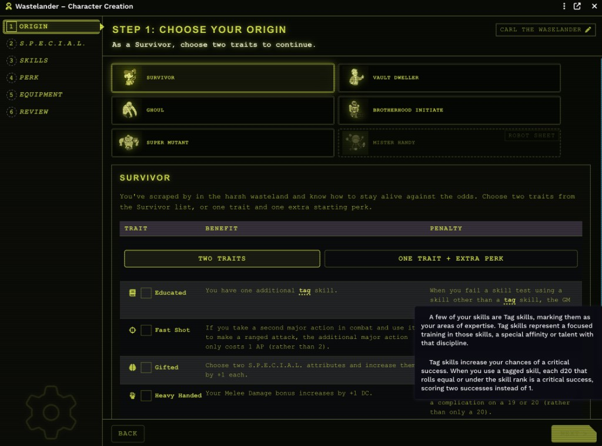
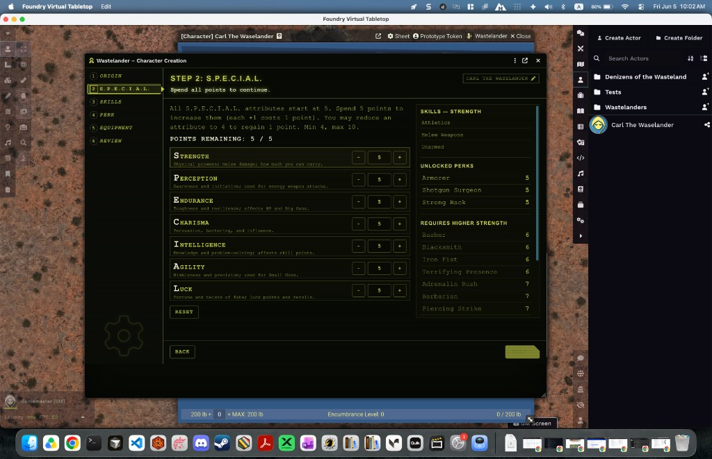
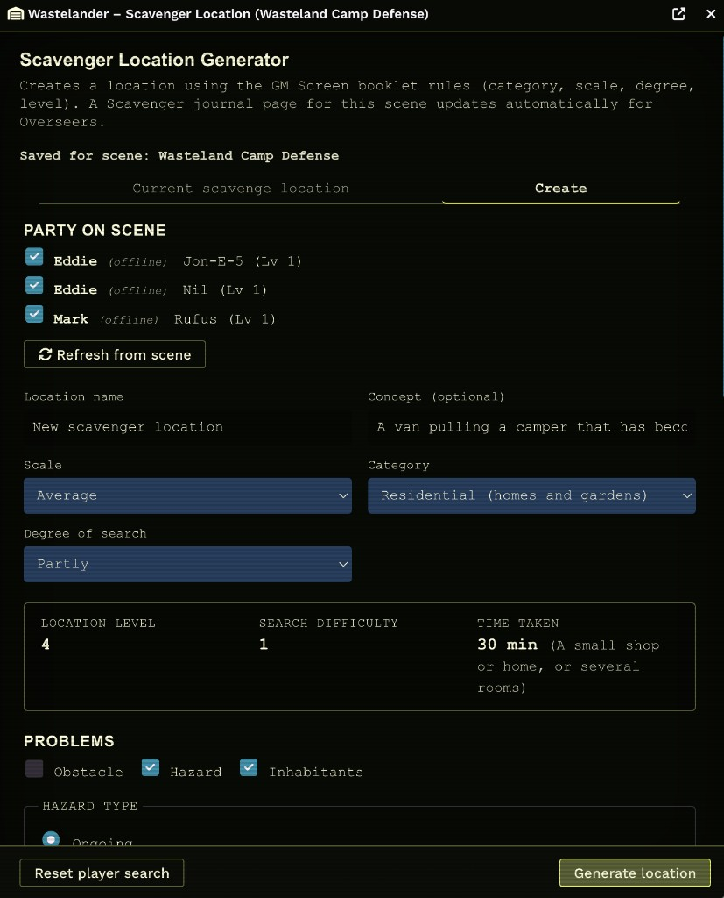
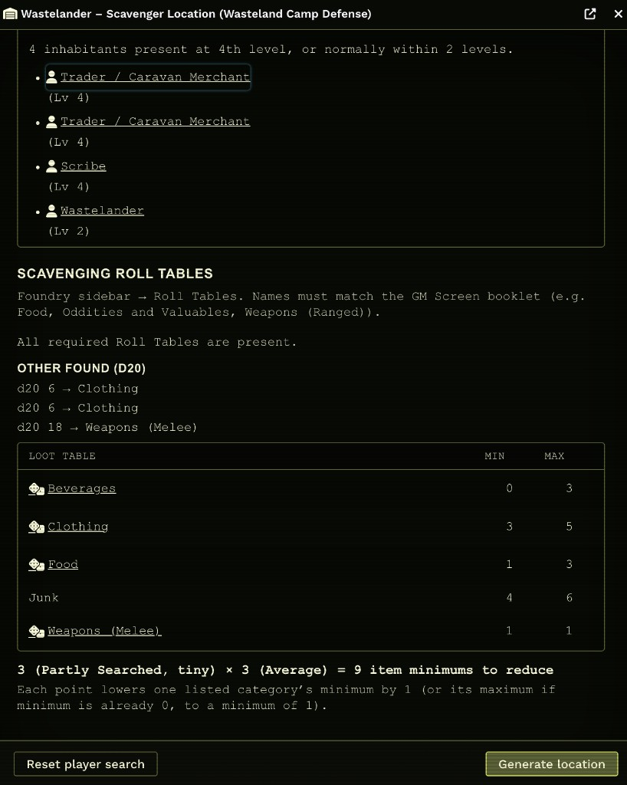
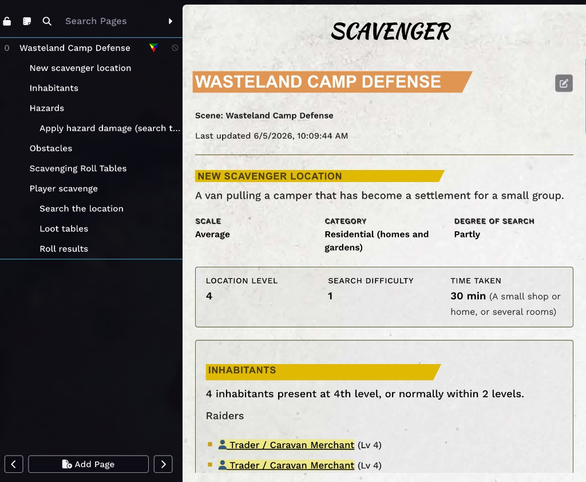
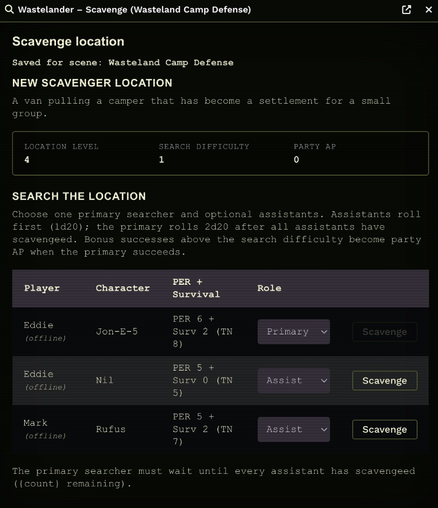

# Wastelander

A Foundry VTT module for **[Fallout: The Roleplaying Game](https://github.com/Muttley/foundryvtt-fallout)** (2d20). Wastelander adds a guided character builder, a full scavenging toolkit, and denizen import tooling — all aligned with the Core Rulebook and GM Screen booklet.

**Requires:** [Fallout 2d20 system](https://github.com/Muttley/foundryvtt-fallout) · Foundry VTT v13+

---

This community contributed and maintained module for playing Fallout: The Roleplaying Game with the Foundry VTT virtual tabletop software.

All copyright assets included in the module are owned by Modiphius Entertainment. The module developers hold no claims to these underlying copyrighted assets.

---

## Installation

1. Install the module in Foundry (manifest URL in `module.json`).
2. Enable **Wastelander** in your world’s module list.
3. *(Optional)* For PDF export, copy your licensed Modiphius character sheets into `Data/modules/wastelander/assets/sheets/` — see [assets/sheets/README.md](assets/sheets/README.md).
4. *(Optional)* Enable **[Simple Calendar Reborn](https://foundryvtt.com/packages/foundryvtt-simple-calendar-reborn)** if you want scavenging to advance the world clock.

### Development

```bash
npm install
npm run build      # production bundle → dist/wastelander.mjs
npm run dev        # watch mode
```

---

## Character builder

Open from any player **character** or **robot** actor sheet (Wastelander menu → **Build character**).



*Step 1: pick an origin, survivor trait mode, and trait details with Pip-Boy tooltips.*



*Step 2: spend attribute points; the side panel lists unlocked perks and what higher stats would unlock.*

- **Step-by-step creation** — Origin, S.P.E.C.I.A.L., skills (including tag skills), perks, equipment, and review.
- **Core origins** — Survivor, Vault Dweller, Ghoul, Brotherhood of Steel, Super Mutant, and Mister Handy (robot sheet).
- **Rulebook-accurate options** — Starting equipment packs, tag-skill loot, personal trinkets, survivor traits, perk eligibility, and derived stats applied to the actor on finish.
- **Compendium integration** — Skills, perks, traits, and gear are pulled from Fallout system compendiums where possible.
- **Companion perks** — Stat block reference in the perk step for animal/robot companions from the rulebook.
- **Flexible navigation** — Jump to any step from the sidebar; **Next** still validates the current step, **Finish** requires all steps to be valid.
- **PDF export & import**
  - **Export to PDF** — Fills the official human or robot character sheet (requires your licensed PDF templates).
  - **Parse PDF** — Upload a filled human or robot sheet to overwrite matching data on the open actor.

---

## Scavenging

Two scene tools (token controls):

| Tool | Who | Purpose |
|------|-----|---------|
| **Scavenger Location** (warehouse) | GM | Generate and manage the location |
| **Scavenge** (magnifying glass) | Players | Search and loot the active scene’s location |

### Overseer — location generator



*Create tab: pick party members on scene, set category/scale/degree, and toggle obstacle, hazard, or inhabitants.*



*After generation: inhabitant roster, GM Screen roll-table status, d20 “Other Found” results, and the loot table grid with min/max counts.*

- **Scene-specific locations** — Each scene stores its own scavenger location, party selection, and player progress.
- **Booklet-driven generation** — Category, scale, degree of search, problems (obstacle / hazard / inhabitants), and location level (party levels + degree + problem effects).
- **Time taken** — Search duration by scale (1 min → 2 hours); shown on the location and used for hazards and world-clock advancement.
- **Inhabitants** — Random counts and roster suggestions from the denizen catalog (import actors first — see **Denizen import**); drag onto the scene or override manually.
- **Obstacles** — Block the scavenge roll until overcome (mechanical / electronic / collapsed / trap types with skill hints).
- **Hazards** — Ongoing hazard damage tied to search time; Overseer can apply CD rolls to party members from the Current tab.
- **GM search override** — On the Current tab, mark player search as **succeeded** or **failed**, or **reset player search** to clear progress without regenerating the location.
- **Automated journal** — A shared Overseer journal page per scene updates with location details, problems, inhabitants, and player scavenge progress.



*Per-scene journal: location stats, inhabitant links, and pages for hazards, obstacles, player scavenge, and loot results.*

### Players — scavenge automation



*Players assign primary vs assist roles, roll in order (assists first), and earn party AP from bonus successes.*

- **Search team** — One primary searcher (PER + Survival) plus optional assistants; assists roll first, then the primary.
- **Bonus party AP** — Extra successes above search difficulty become party AP (Fallout system AP tracker).
- **Obstacle gate** — Search is blocked until the Overseer marks the obstacle overcome.
- **AP loot rolls** — After a successful search, spend party AP to roll on category loot tables.
- **Luck Points** — Shift loot roll results up or down; luck spend posts to chat.
- **Full loot tables** — Ammunition, apparel, chems, food, oddities, weapons, and more; works with **Fallout Scavenging** actors and world RollTables when enabled.
- **World clock** — On search completion, advances **Simple Calendar** by the location’s Time Taken (module setting; GM-only).

Player actions are validated on the GM client over Foundry’s socket so players cannot spoof rolls or loot.

---

## Denizen import

Wastelander does **not** redistribute rulebook NPC actors. It provides an import workflow so you can bring your own Foundry actor exports into the world and use them with scavenging.

### Provide actor JSON

Export actors from your Fallout world (or build them yourself), then add the JSON files before building the module:

1. Place Foundry actor exports in `src/data/denizens/` (gitignored — not committed to the repo).
2. Rebuild the catalog and module bundle:

```bash
npm run build:denizens   # writes src/data/scavenging/denizens-catalog.json
npm run build
```

3. Reload the module in Foundry. The import menu shows how many JSON files were bundled in that build.

If no JSON is present at build time, import is unavailable until you add exports and rebuild.

### Import to world

**Configure Settings → Module Settings → Wastelander → Import denizens** (or **Import denizens…** on the Actors sidebar)

- **GM only** — creates actors in the sidebar (does not auto-place tokens).
- **Idempotent** — skips any name that already exists in the world.
- **Your stat blocks** — imports whatever skills, gear, and abilities are in your exports.
- **Robot-aware** — robot exports are normalized (body type, favorited weapons, post-import repair pass).

After import, reload Foundry if new actors do not appear in the sidebar immediately.

### Rulebook folder layout

Imported actors are filed under **Denizens of the Wasteland**, matching the Core Rulebook organization (Animals and Insects, Raiders, Robots, Super Mutants, Synths, Turrets, Brotherhood of Steel, Wastelanders, and Mutated Humanoids).

### Tied to scavenging

The denizen **catalog** (slim metadata in `denizens-catalog.json`, built from your exports) feeds the **Scavenger Location** generator:

- **Inhabitant catalog** — level, type, and size metadata for roster matching.
- **Random inhabitant counts** — rolled when you generate a location (by scale and inhabitant type).
- **Roster suggestions** — denizens near the location level appear on the Current tab; click to open the imported actor or **drag onto the scene** to place tokens.

Run import once per world after bundling your JSON, then scavenging inhabitant workflows can link roster entries to world actors.

---

## Bundled compendiums

The module includes a **Wastelander** compendium folder with two packs:

| Pack | Contents |
|------|----------|
| **Items** | Custom items (consumables, gear, etc.) used when scavenging resolves loot to compendium entries |
| **Wastelander** | RollTable loot tables for scavenging (booklet-style names such as ammunition, food, armor) |

They appear automatically when the module is enabled. Scavenging looks up roll tables in `wastelander.wastelander` first, then Fallout system tables.

To refresh pack data from your Foundry world after editing compendiums, see [packs/README.md](packs/README.md).

---

## Optional integrations

| Module / feature | Used for |
|------------------|----------|
| [foundryvtt-fallout](https://github.com/Muttley/foundryvtt-fallout) | **Required** — actors, compendiums, AP tracker, sheets |
| Simple Calendar Reborn | Advance world time after scavenging |
| Licensed Modiphius PDFs | Character sheet export only |
| Bundled `wastelander.items` / `wastelander.wastelander` | Custom scavenging items and roll tables (included with module) |

---

## Module settings (scavenging)

- **Prefer Foundry RollTables** — Player AP loot rolls use world Roll Tables when names match the GM Screen booklet (falls back to bundled tables).
- **Whisper loot rolls to GM** — Loot roll chat cards visible only to the GM.
- **Advance world clock after search** — Simple Calendar integration (default on).
- **Auto-allocate degree reductions** — Randomly apply minimum reductions when generating a location.

---

## License

See [LICENSE](LICENSE). Fallout RPG rules content and official PDF character sheets are © Modiphius Entertainment; this module does not redistribute them. Denizen actor JSON is supplied by the module user at build time; the module does not ship rulebook NPC stat blocks.
