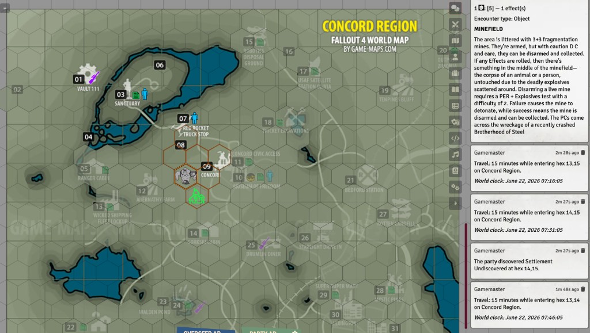
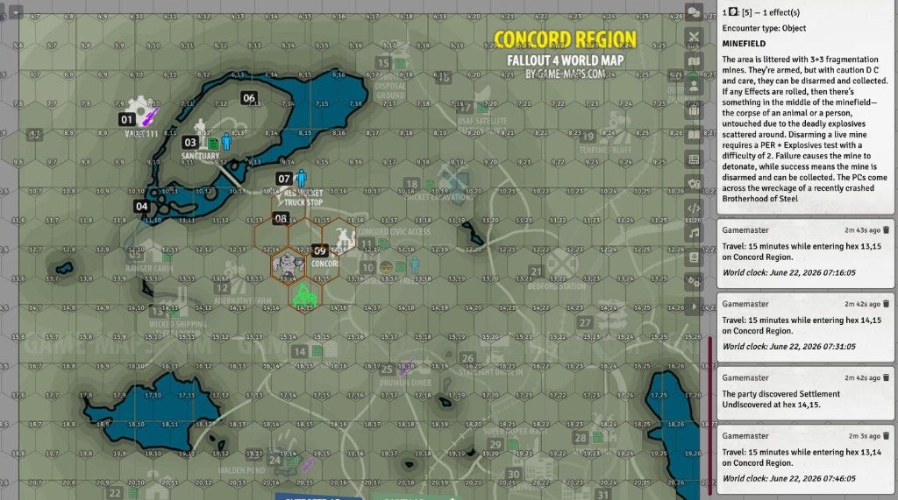
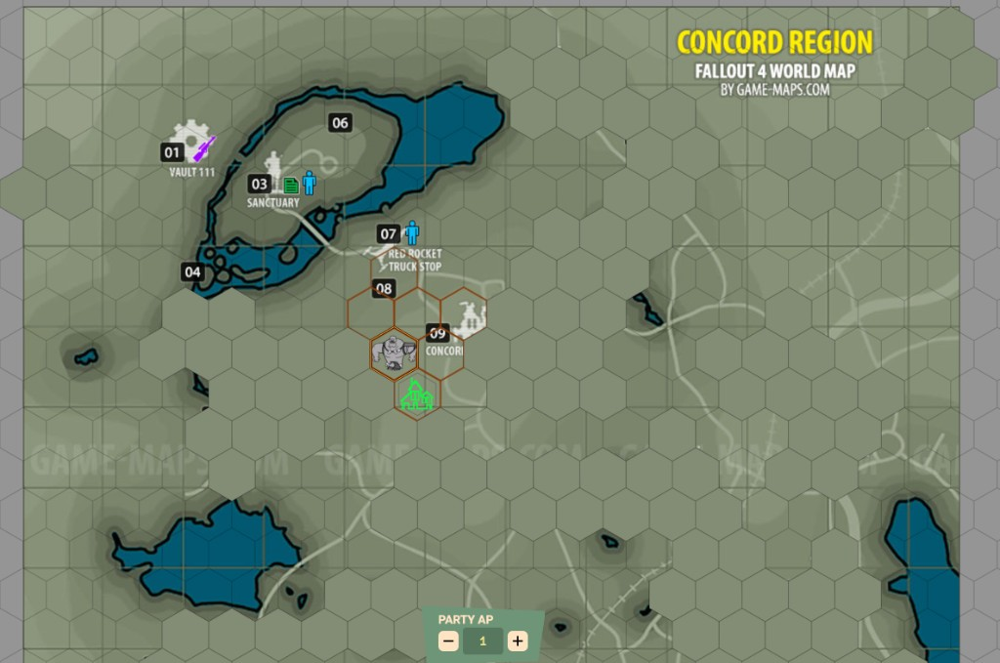
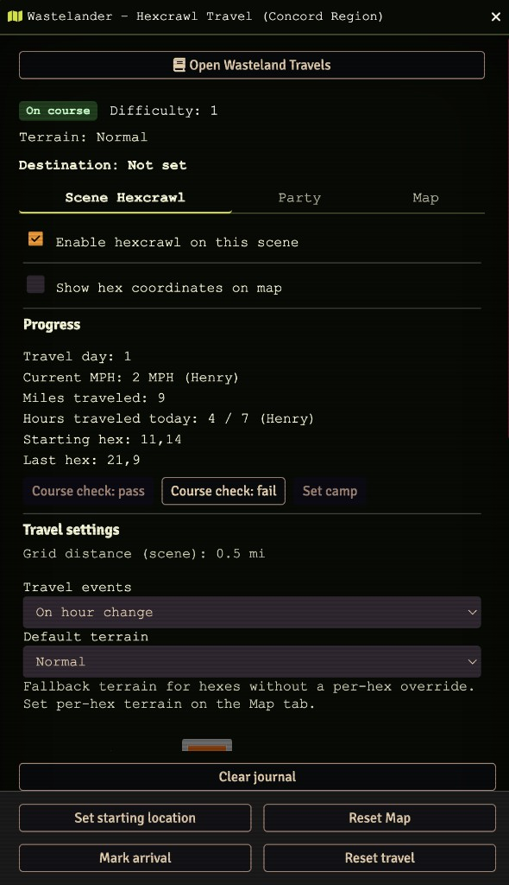
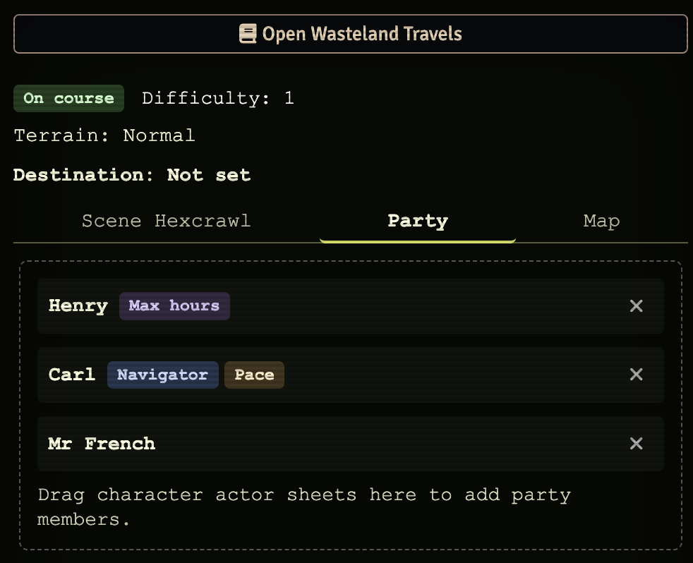
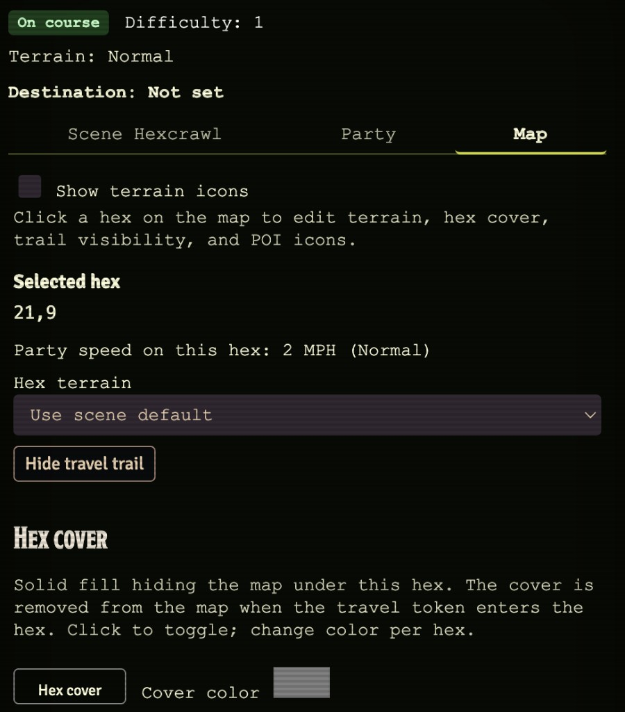
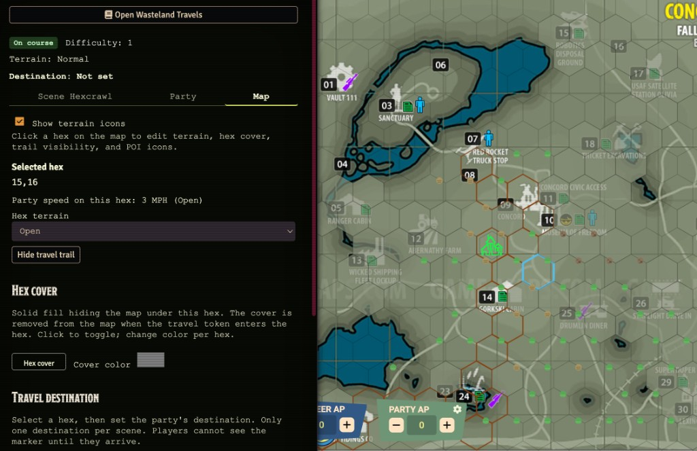
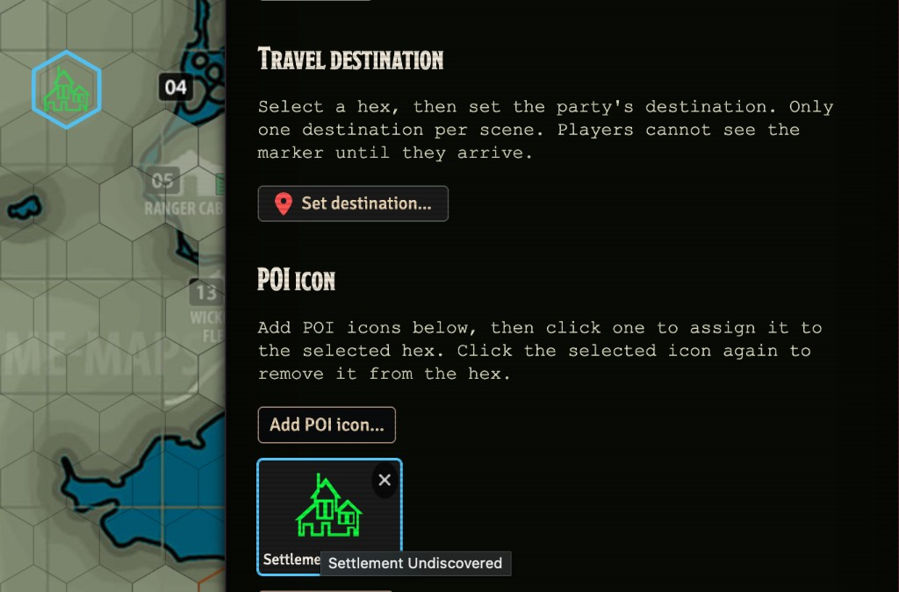
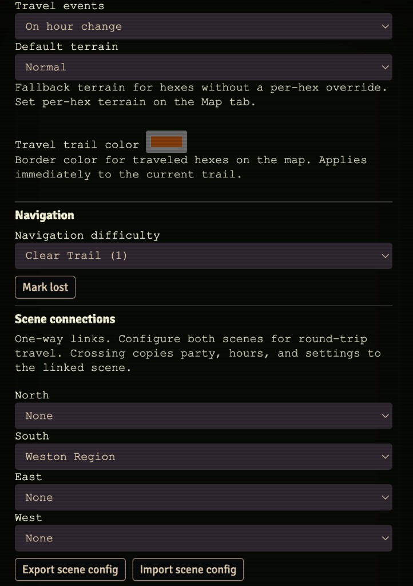
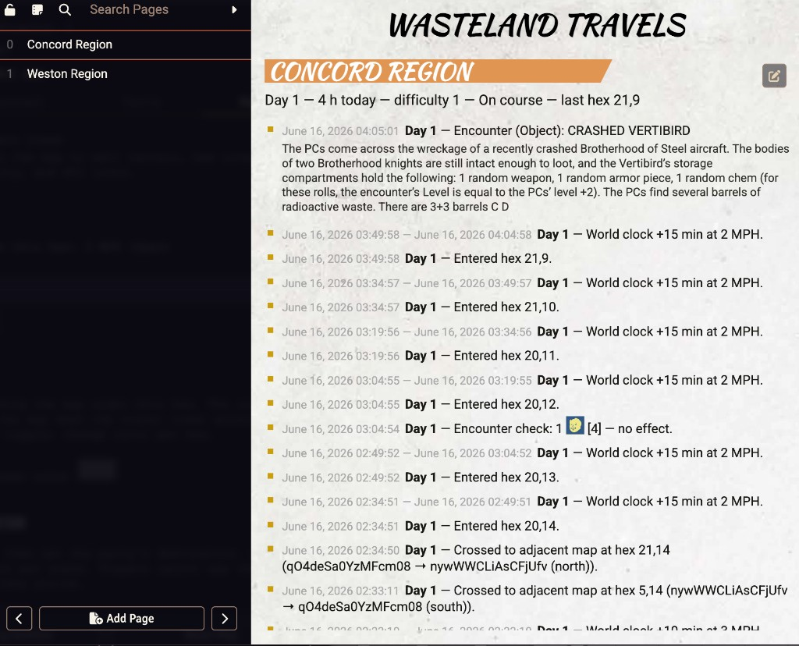

# Hexcrawl travel (GM Toolkit)

Scene-tied hexcrawl travel using rules from **Fallout 2d20 GM Toolkit** (travel pp.9–17, encounters pp.20–24).

## Encounter tables (local build)

1. Place `Fallout-2d20-GM-Toolkit.pdf` at `docs/reference/source/`.
2. Extract manifests: `npm run extract:encounters`
3. Build Foundry JSON: `npm run build:encounters`
4. Bundle module: `npm run build`
5. In Foundry: **Settings → Wastelander → Import encounter tables**

Tables appear under **Roll Tables → Wastelander → Encounters**.

## Using hexcrawl in a scene

1. Open the overworld scene and use the **route** token toolbar button (Overseer).
2. Enable **Hexcrawl on this scene** (off by default on other scenes).
3. Optionally accept hex grid setup (6 mi/hex default; adjust scale to your map).
4. Select the **party travel token** and party actors.
5. Drag the travel token across hex boundaries.

On each new hex:

- World clock advances (if Simple Calendar + setting enabled)
- 1CD is rolled; on Effect, encounter type → detail table
- **Wasteland Travels** journal updates (one page per scene)
- A **travel trail** border appears on that hex (see below)

*Orange trail borders on visited hexes, a discovered settlement POI, and travel journal entries in chat.*

## Travel trail (map overlay)

When hexcrawl is enabled on a hex scene, traveled hexes show an amber **border-only** outline aligned to Foundry's hex grid. The overlay sits below tokens and is not selectable.

| Event | Trail on map |
| --- | --- |
| Set starting hex | Starting hex outlined |
| Enter hex during travel | Hex added to trail; current hex highlighted |
| Set camp / new travel day | Trail **persists** (cumulative breadcrumb) |
| Reset travel | Trail resets to starting hex only |
| Clear journal | Trail **cleared** from map (starting hex hidden until next travel or set starting) |
| Disable hexcrawl | Trail hidden (data retained) |

Trail state is stored in scene flags as `traveledHexKeys` and syncs to all connected clients when travel state updates. The starting hex is always outlined when set, even if it was not yet visited during travel. Revisiting a hex does not duplicate its border.

Overseers can change **Travel trail color** in the Scene tab under Travel settings; the new color applies immediately to all outlined hexes on the map.

Enable **Show hex coordinates on map** (Scene tab) to label each cell for map editing and cross-scene alignment.

*Per-hex coordinates (e.g. `14,15`) at the bottom of each cell.*

## Terrain and travel speed

**Default terrain** (Scene tab) is the fallback for hexes without a per-hex override. Party speed uses the slowest member's AGI on the GM Toolkit p.9 table (open / normal / rough / hard).

When the party **enters a hex**, travel time uses that hex's stored terrain if set, otherwise the scene default. The status bar **Current MPH** reflects the party's speed on the **current hex** (`lastHexKey`).

## Per-hex map editor (Map tab)

Overseers can open the **Map** tab, click a hex on the canvas, and:

| Action | Effect |
| --- | --- |
| Set hex terrain | Persists per hex; small terrain badge in the hex corner; auto-applies on entry |
| Hex cover | Solid fill over the hex map (default gray); per-hex color; hidden from players after they enter |
| Hide travel trail | Removes trail outline for that hex only (journey log unchanged) |
| POI icon | Large preset icon centered on the hex (ruins, camp, settlement, etc.) |
| Clear hex data | Removes terrain, icon, and trail hide for that hex |

**POI fog of war:** Players do not see POI icons until the party travel token **enters** that hex. Once discovered, the icon stays visible even after the token leaves. Overseers always see all POI icons (including undiscovered) for map editing. Terrain badges are always visible to everyone.

**Hex cover:** A solid fill blocks the hex map background for players until they enter that hex; the cover stays off after that (terrain badges and POI icons still follow their own rules). Overseers always see covers and can set each hex's color (default gray `#808080`).

*Solid per-hex covers hide unexplored map detail; entered hexes and POI markers remain visible.*

Per-hex data is stored in scene flags as `hexAnnotations` and `hiddenTrailHexKeys`. Discovered POI hex keys are stored in `discoveredPoiHexKeys`. Entering a hex with the travel token deletes that hex's cover from `hexAnnotations` (not merely hidden). Cross-scene travel keeps each scene's own hex map data.

Regenerate map icons after clone: `node scripts/generate-hexcrawl-icons.mjs`

## Cross-scene border travel

Optional **Scene connections** (North / South / East / West) link this map to adjacent overworld scenes. Links are **one-way** — configure both scenes for round-trip travel.

When the **navigator token** is dragged past the **background image** edge toward a configured link:

1. The last in-bounds hex counts as normal travel (hours, encounters, journal).
2. Party, navigation settings, travel day, hours today, trail color, and journal continue on the **target** scene.
3. The navigator is placed on the **opposite border** of the target map (pixel-proximity matching along the shared edge).
4. The target scene keeps its own scene links, starting hex, and per-hex map data (if set).
5. Foundry activates the linked scene.

If a direction has no link configured, dragging off the image behaves as before (move blocked). Maps with different grid offsets may need aligned borders for best entry-hex matching.

## Scene config export / import

Overseers can back up or share **map and travel template** data as JSON from the Scene tab, below **Scene connections**.

| Button | Action |
| --- | --- |
| **Export scene config** | Downloads a `.json` file for the current scene plus any scenes reachable via configured outbound scene links (a region pack). |
| **Import scene config** | Overwrites the **current scene only** from a matching entry in the file (matched by scene **name**). |

### What is included

Per scene in the file:

- Enable flag, travel event mode, default terrain, navigation condition, trail color
- Scene links (stored as **scene names**, not Foundry IDs — portable between worlds)
- Per-hex map data: terrain, hide covers, POI icon ids, hidden trail hexes, overlay toggles
- Custom POI icons referenced on the map (world catalog subset)

Linked neighbor scenes are included in the export file so you can share a whole region; import each scene separately by opening that scene and running import again.

### What is not included (preserved on import)

Import does **not** change:

- Party members, navigator, or travel token
- Starting hex (map anchor — set per scene after import)
- Travel progress (hours, miles, travel day, last hex, course status)
- Travel trail / visited hex keys
- Journey log
- Map destinations (current or inherited from linked scenes)
- Discovered POI fog-of-war state

### Tips

- Scene names in the target world must match the names in the JSON (Foundry scene IDs may differ — you may see a harmless id-mismatch warning).
- Custom POI image **paths** must exist on the server that imports the file, or icons will not render until those assets are available.
- Re-export after editing the map if you want the JSON to include every hide cover from `hexCoverBaseline` (covers removed by travel are restored from baseline on export).

Export filename pattern: `hexcrawl-{scene-slug}-{date}.json`.

## Navigation (MVP)

- Set **Navigation difficulty** from GM Toolkit conditions (base difficulty).
- At day end, Overseer marks **course check pass/fail** or **lost / on course**.
- **Mark arrival** pauses travel until resumed.

## Deferred

Camping watches and player Survival assist UI are not in MVP.

## UI gallery

Click a thumbnail for the full-size image.

<table>
  <tr>
    <td width="50%" align="center" valign="top">
       <em>Scene tab — progress, travel settings, and footer actions</em>
    </td>
    <td width="50%" align="center" valign="top">
       <em>Party tab — navigator, pace, and max-hours roles</em>
    </td>
  </tr>
  <tr>
    <td width="50%" align="center" valign="top">
       <em>Map tab — per-hex terrain, cover color, and trail hide</em>
    </td>
    <td width="50%" align="center" valign="top">
       <em>Map tab with canvas — hex cover on water, trail, and POIs</em>
    </td>
  </tr>
  <tr>
    <td width="50%" align="center" valign="top">
       <em>POI icons — custom settlement marker on a hex</em>
    </td>
    <td width="50%" align="center" valign="top">
       <em>Scene connections, trail color, and export / import</em>
    </td>
  </tr>
  <tr>
    <td colspan="2" align="center" valign="top">
       <em>Wasteland Travels journal — per-scene travel log with encounters and hex entries</em>
    </td>
  </tr>
</table>
